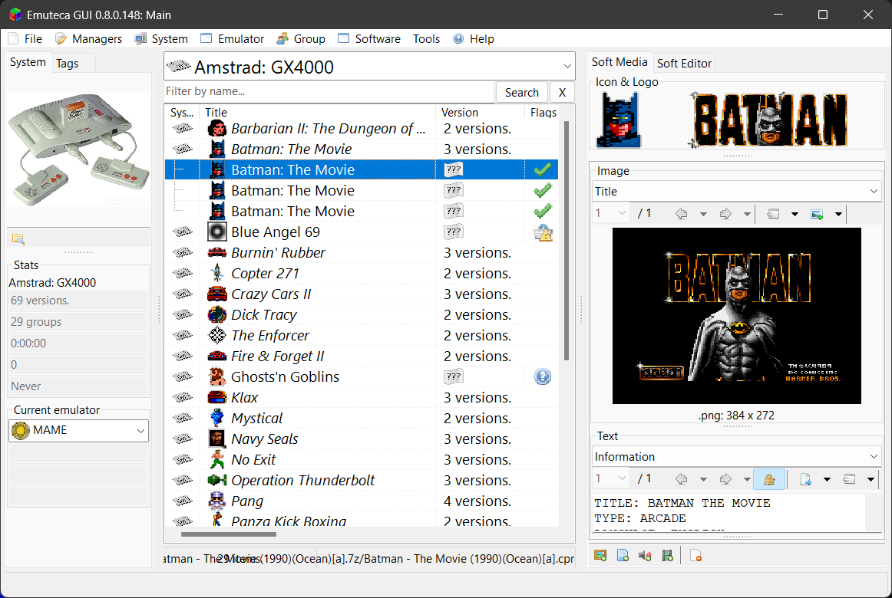

***Emuteca*** es un *front-end* para gestionar emuladores y ROMs. Inspirado inicialmente en [QuickPlay](http://www.quickplayfrontend.com), pero de desarrollo totalmente independiente.

La versión 0.8 está desarrollada desde cero nuevamente; y aunque es perfectamente funcional y bastante estable, quedan cosas por terminar y mejorar. 

A partir de aquí, puedes visitar el resto de la web:


