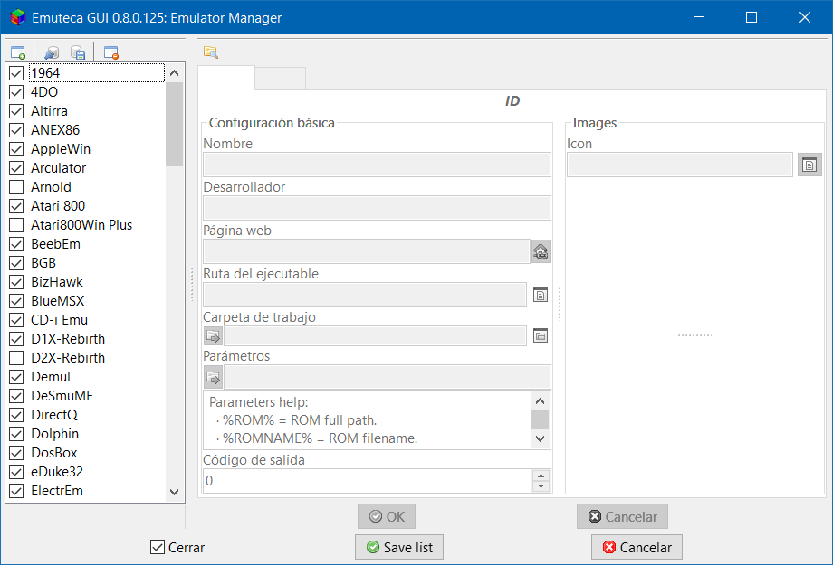

El Gestor de Emuladores es el cuadro de diálogo donde se pueden activar los distintos emuladores.

Para poder seleccionar un emulador en cualquier otra parte de Emuteca, éste debe ser activado desde este cuadro de diálogo.

Además contiene incrustado a la derecha el [Editor de Emuladores](EmulatorEditor) para poder editarlos también desde este cuadro de diálogo. Para más detalles sobre la configuración de los emuladores [ve a su correspondiente página](EmulatorEditor).

Dejando la descripción del Editor de Emuladores para su página correspondienete, el Gestor cuenta con una barra de botones, una lista con todos los emuladores y los habituales botones para aceptar los cambios hechos en el Gestor.

NOTA: El Editor de Emuladores tiene sus propios botones para aceptar los cambios hechos en la configuración del emulador seleccionado, recuerda aceptarlos antes de guardar la lista o cambiar de emulador.

## Botones 

Encima de la lista de emuladores se encuentran los botones:

  - Añadir emulador: Sirve para añadir un emulador nuevo, con el que se abrirá una ventana preguntando el nombre (si se deja vacío se aborta la creación del nuevo emulador).
  - Importar emuladores: Sirve para importar emuladores y sus configuraciones de un archivo.
  - Exportar emuladores: Para exportar la lista de emuladores y sus configuraciones; aunque no exporta las configuraciones propias del usuario (rutas del ejecutable e imágenes).
  - Quitar emulador: Sirve para eliminar un emulador de la lista.

NOTA: Se tiene planeado añadir otro botón para clonar un emulador; es decir, crear uno nuevo copiando las configuraciones de otro previamente seleccionado.

## Lista de emuladores 

En la lista de emuladores se pueden seleccionar los emuladores que se van a activar para Emuteca.

Los emuladores no marcados no aparecerán en el resto de apartados de Emuteca.

RECUERDA: Debes salvar la lista para que se guarden los cambios y no confundir con el botón de guardar los cambios del Editor de Emuladores incrustado.

## Editor de Emuladores

Para información más específica sobre el [Editor de Emuladores](EmulatorEditor) incrustado, ve a [su página correspondiente](EmulatorEditor).

Sin embargo, recuerda usar el botón para guardar los cambios cuando vayas a guardar la lista o cambies de emulador seleccionado.