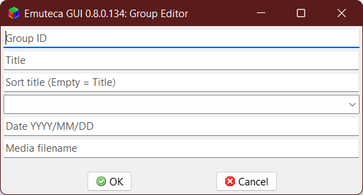

El Editor de Grupo es el cuadro de diálogo donde se pueden editar las propiedades de cada grupo.

Este editor se puede ver tanto con su ventana propia con la opción de menú "Editar Grupo..." o incrustado en el [Editor de Software](Dialogs/SoftwareEditor).

## Propiedades para editar 

Inicialmente por ahorrar espacio los campos no tienen un encabezado indicando que es cada cosa. Aunque si se borran los campos o se mantiene el ratón sobre ellos indican su función.

### Identificador del grupo 

Texto con el que identificar el juego.

Este texto es usado:

  - Asignar versiones a cada grupo (en ficheros de datos y bases de datos para importar).
  - Asignar etiquetas a los grupos.
  
Por conveniencia, en el sistema Arcade se usan los identificadores de MAME para las ROM padre. 

Para los demás sistemas realmente es indiferente. Aunque es conveniente que sea igual que la clave de ordenación por legibilidad y comodidad en los archivos de etiquetas, archivos de datos y bases de datos. (Si no fuera por MAME, incluso se hubiera usado esta última como identificador).

En caso de editarlo, Emuteca actualiza automáticamente la propiedad en todas las versiones asociadas al grupo, pero no actualiza los ficheros de etiquetas.

### Título

Tan "simple" como el título completo del juego. 

Este texto es usado para su visualización.

Pero esto se puede complicar mucho:

  - Debe ser el más completo, con subtítulos incluidos (y estos separados con ": ")
    - "Super Mario Land 2" -> "Super Mario Land 2: 6 Golden Coins".
  - Si el título del juego depende de la zona, usar normalmente USA->EU->JPN
    - Aunque se hacer excepciones si el nombre del juego en su versión occidental claramente no es apropiado o la franquicia fue renombrada a posteriori por problemas legales, censura o similar:
      - SNES "Final Fantasy III" (US) -> "Final Fantasy VI"
      - "Dragon Warrior" -> "Dragon Quest"
  - Si solo salió en Japón: **Aquí deberían usarse caracteres japoneses** (y de igual forma con cirílico, griego, árabe si se da el caso).
  - Si hay incongruencias entre manual, frontal, pantalla de título, &c.; elegir el que mejor convenga para la saga 
    - Title Screen = "David Crane's A Boy and His Blob in... The Rescue of Princess Blobette" ~ Box Front = "David Crane's The Rescue of Princess Blobette starring A Boy and His Blob" -> Elegir el primero
  - Añadir los "Algo's" como puede ser "Disney's", "David Crane's", "Hudson's", "John Romero's", etc.
  
 En caso de estar vacío se usará el identificador del grupo.

### Clave de ordenación 

Texto formateado para una correcta ordenación de los juegos de forma alfabética.

Para conseguirla se debería seguir los siguientes pasos:

  1. Transliterar (que no traducir) los caracteres no ASCII.
    - Kanjis, Cirílico, etc.
  2. Eliminar tildes, acentos y otras marcas ortográficas que no deberían intervenir en la ordenación.
    - "ê" = "é" = "è" = "ë" -> "e"
    - "ñ" -> "n" (Realmente debería ser "nzz", pero no afectará en casi nada)
  3. Eliminar "Algo's"
  4. Eliminar artículos iniciales ("The", "A", o equivalentes en otros idiomas) del título, no hace falta de los subtítulos.
    - "El", "La", "Los", "Las", "Una" en español. Cuidado con "Un" puesto que se puede referir al número en vez de ser un artículo.
  5. Cambiar números romanos por arábigos si se refiere al número del capítulo.
  6. *Por decidir: Eliminar números iniciales que funcionen como artículo.*
  7. Añadir "0" a la izquierda del número del capítulo o añadir "1" al primero si es necesario.
  
En caso de estar vacío se usará automáticamente el título del grupo.

### Desarrollador

Nombre de la empresa, grupo o persona desarrolladora del videojuego, no confundir con el editor/distribuidor/publicador.

En caso de compañías grandes, es preferible el nombre del equipo interno.

### Fecha 

Fecha en la que fue programado o el lanzamiento de la primera versión.

### Nombre de fichero para medios 

Nombre por el que buscar los fichero multimedia del grupo.

Realmente... desde que se decidió dejar de usar el identificador de MAME para buscar, ya no sería necesario usarla. Teniendo bastantes posibilidades de acabar siendo elimininada esta propiedad.

En caso de estar vacío se usará la clave de ordenación, modificada automáticamente para que no contenga carateres inválidos nombres de ficheros en Windows.