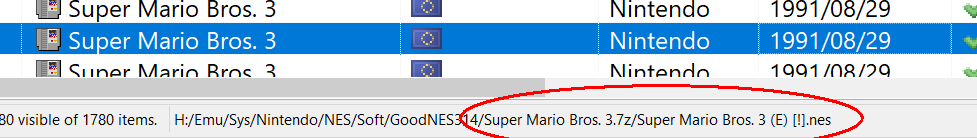

La configuración de los emuladores puede ser muy variada; desde los más sencillos que simplemente necesitan las rutas del ejecutable y la ROM; hasta otros más complejos que necesitan un identificador del sistema a emular, unos parámetros específicos para cada tipo de archivo e incluso otros especificos para cada ROM.

Más complejo aún, además se pueden usar otros archivos auxiliares para discernir que versión del "emulador" específica es necesaria para ejecutar un juego (Por ejemplo, OpenBOR)

También hay emuladores que de nada sirve, puesto que no soportan ejecutar el juego desde la línea de comandos. Aunque se puede aprovechar Emuteca para las tareas de organización, descompresión y colocación de los archivos de la ROM en un lugar cómodo para usar con el emulador.

